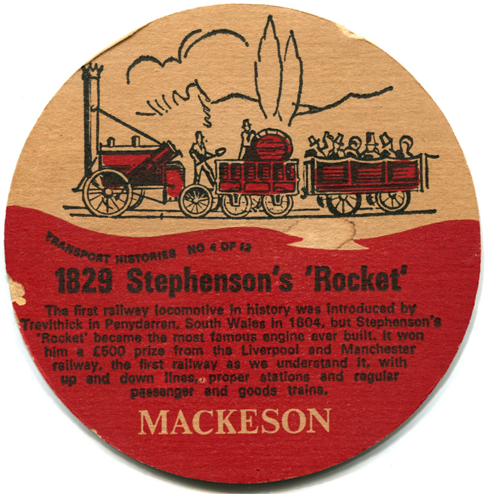
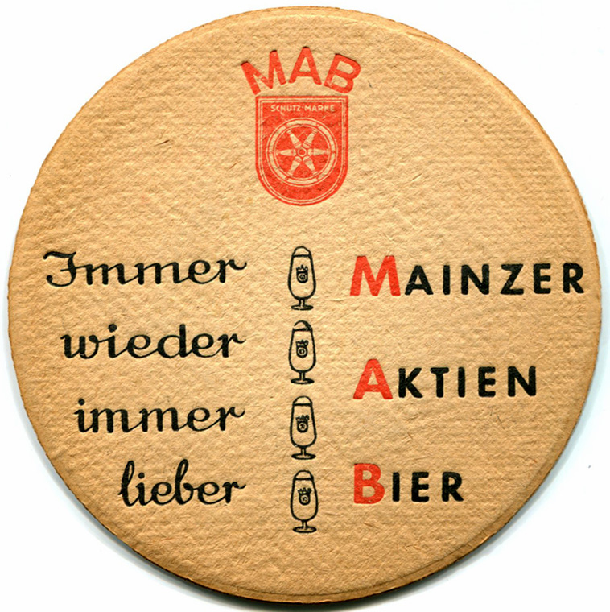
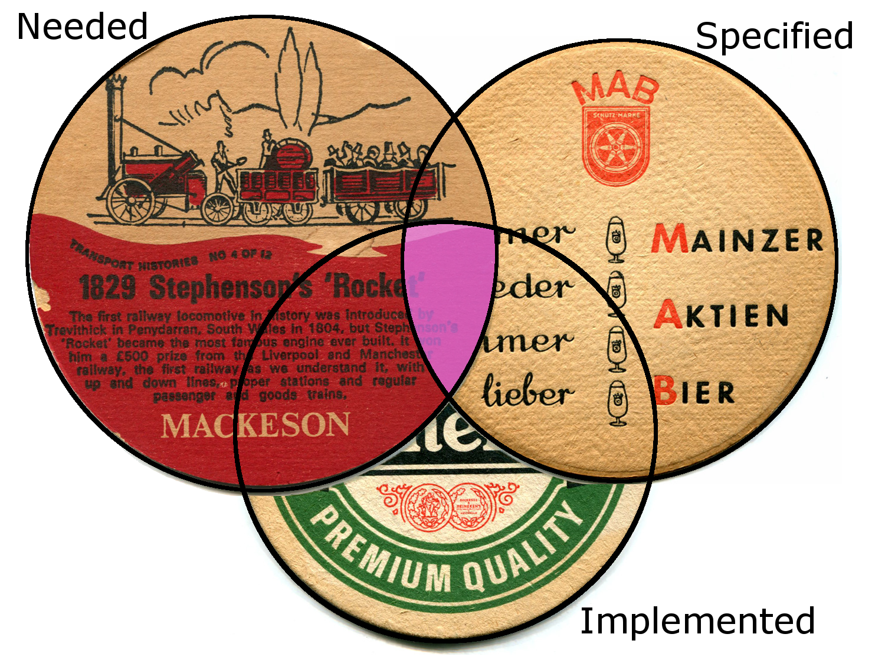
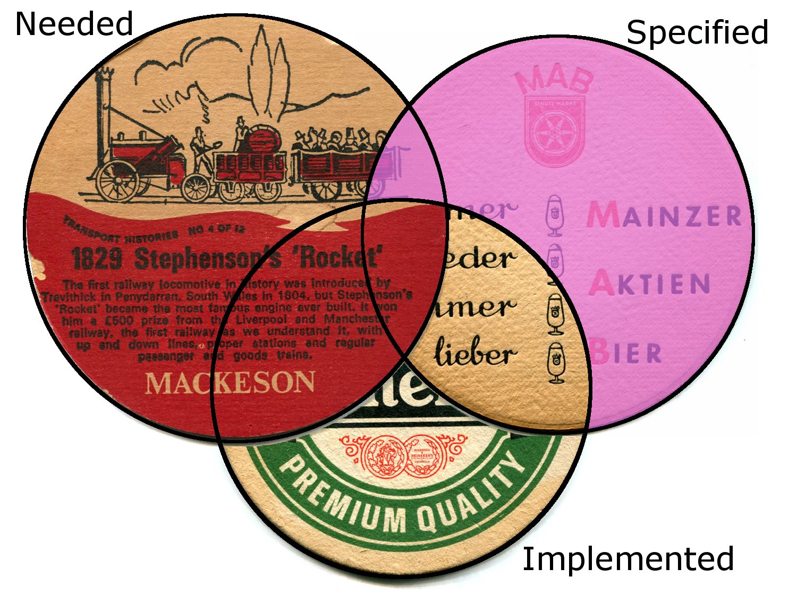
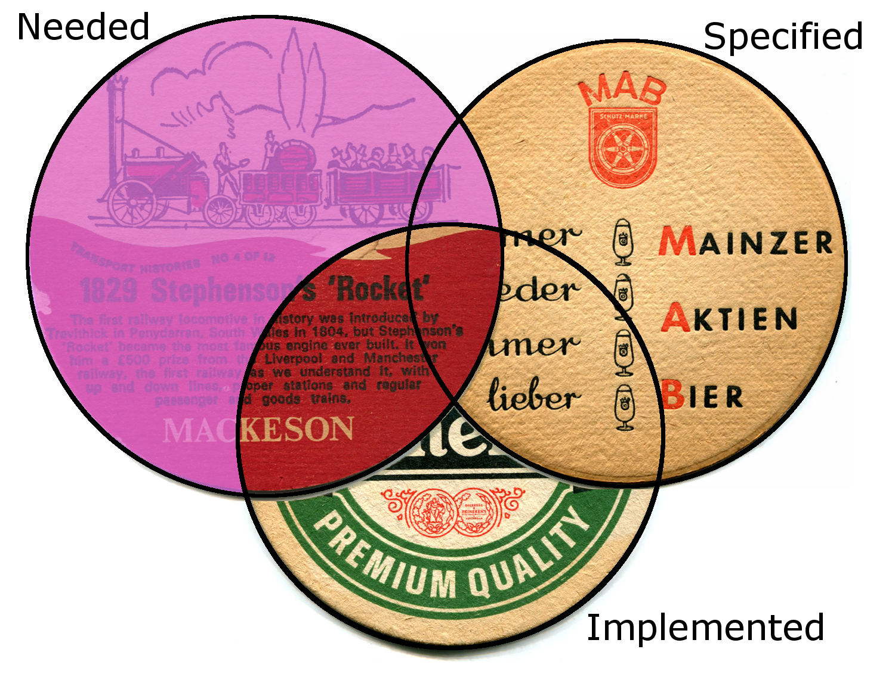
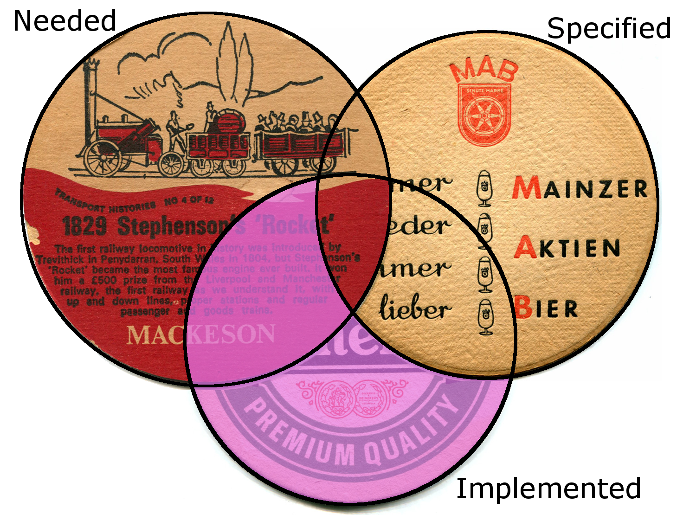
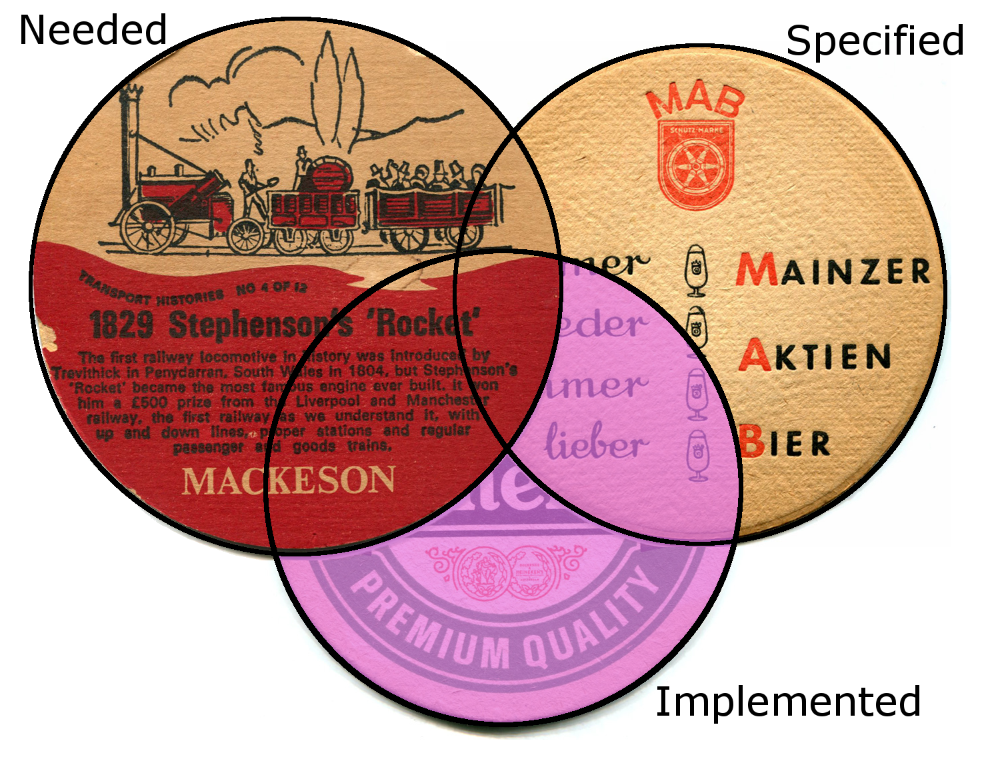

<!-- Copy and paste the converted output. -->

<!-----
NEW: Check the "Suppress top comment" option to remove this info from the output.

Conversion time: 5.615 seconds.

Using this Markdown file:

1. Paste this output into your source file.
2. See the notes and action items below regarding this conversion run.
3. Check the rendered output (headings, lists, code blocks, tables) for proper
   formatting and use a linkchecker before you publish this page.

Conversion notes:

* Docs to Markdown version 1.0β29
* Thu Feb 04 2021 03:17:46 GMT-0800 (PST)
* Source doc: Ask a Stupid Equestrian
* This document has images: check for >>>>>  gd2md-html alert:  inline image link in generated source and store images to your server. NOTE: Images in exported zip file from Google Docs may not appear in  the same order as they do in your doc. Please check the images!

----->

# Ask a Stupid Equestrian

James Thomas

So this horse trotted into a pub. "Why the long face?" asked the chap behind the bar. The horse said "I've been testing software all day."

"Testing software," the barman chortled, "is _easy_, you just need to make sure it does what it’s supposed to.”

The horse bridled at that and picked up three beer mats, while whinnying "you can think of it this way: there's the things we need to do" and it jabbed a fetlock at the first mat, "the things we specified we would do," a point at the second, "and what we implemented," with a final poke at the third mat.

     
     
     

  

"Hmm ... drink?"

"Wine?"

"Red or white?"

"Got any Eck?"

"Eck wine?"

Silence for a moment. The horse raised its eyebrows slightly. The barman pulled his own long face and the horse turned back to the mats, arranging them into an overlapping trefoil.

"So the bit where all three intersect, that's where the novice might imagine the tester does his or her work: we needed it, we planned to do it, we built it, and now we just check it before we ship it."

Glancing around, the barman saw there was no-one else in the place, so he was saddled with the horse, hopefully not furlong.

Barely out of the gate yet, the horse continued enthusiastically. "Checking the software against the spec could confirm some of that but it’d find mostly things that we'd said we wanted but hadn't done or had done but done wrong." 

It gestured towards the mats again, “that’s this part.”

"What about finding things that we _needed_ to do but didn't do, eh? We can't find all of those by checking the spec and you can bet your bottom dollar there'll be some." It waved a hoof towards the first mat and continued on "some of them we might not even _know_ we needed to do."

"Hmmnmmnn?" the barman said distractedly, like a blinkered project manager waiting for a break in the conversation to request another feature. 

But the horse had got the bit between its teeth now, "and then there's the things that we've implemented that no-one asked for." Nostrils flared, it stabbed the third mat. 

"Sometimes we’re onto a winner — a bit of extra useful functionality — but we might also have inadvertently changed existing behaviour somewhere else in the product ...” 

The barman was having a mare. Still no other punters.

"... and then we might have implemented stuff that wasn’t needed; customers don't want it, or it interacts badly with something else, or ..." and it dropped its head as it gestured in the general direction of the third mat again, feeling foalish at the tears in its eyes, "... where's the manual for finding that, eh?"

"Time to rein you in, I think" said the barman, walking round to the horse and (infeasibly, but no more so than a horse speaking eloquently about testing) putting his arm round its shoulders.

"And as for stable builds ..." but from long experience the barman knew it ill behooved him to let the horse get on to that so he ushered it towards the door and turfed it out.

"'Night."

"'Neiggghhht."

_An earlier version of this story appeared in [Hiccupps](https://qahiccupps.blogspot.com/2013/08/ask-stupid-equestrian.html). It is based on Iain McCowatt's excellent article [Spec Checking and Bug Blindness](http://web.archive.org/web/20140729150250/http://exploringuncertainty.com/blog/archives/253) (linked here from the [Wayback Machine](http://web.archive.org/)) with his kind permission. _
