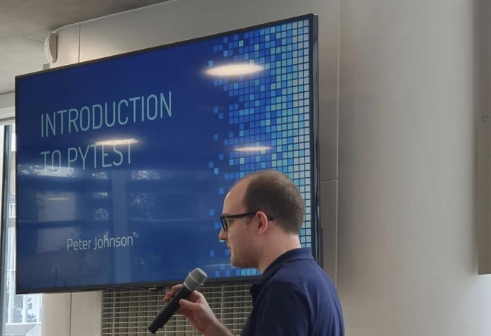

# How can I become a SDET?

A better question is how can I be successful in my career? 
What I’m going to describe here is really applicable to any career in tech!

## Find your passion, so you can be dedicated

I started my career in 2011 as a test technician performing manual system testing on telecommunication equipment, 
today I work as a senior SDET, developing test automation frameworks and lead quality strategies. 
Back in 2011, I knew very little about testing and software development and I wasn't even aware of testing as a career 
option. However, my first job ignited a passion for learning and curiosity in computer science and testing where every 
day was a school day, and I could learn something new. Passion is not something that just happens overnight, 
it’s a process that takes time and sometimes obstacles get in the way, or you can get disheartened by not understanding 
a concept at first; but the key is to persist with something a little longer even when the novelty has worn off, and 
the challenges start. Find your passion as it will keep you dedicated, my advice would be to try many things and stick 
with something that you are curious about and find engaging.

## Develop skills that can help you solve problems

Simply put, you need to develop some skills if you want to work for someone, whether that be for your employer or for 
one of your customers. Find out what skills you bring to the table, start developing skills as soon as you can, don’t 
fear perfection and just start and take small steps each day or week. One of the first skills I wanted to learn in 2011 
was the ability to code in Java, and I started by finding opportunities to apply what I was learning at work and set 
myself goals for studying so much each week. Talk to your manager, a colleague or a friend and see how people can support 
you, ideally you want to find someone who can hold you accountable. You need to be vocal and direct about what you want 
to learn, don’t feel it’s a weakness to discuss what you are learning with others. I’ve learned a lot from having 
discussions with colleagues and peers by testing my ideas and understanding. Pick one skill, focus and practice it every 
day or week. 
Malcolm Gladwell states in his Outliers book it takes 10,000 hours of practice to master a skill, so start now!

## Set goals and work towards them every week

Develop a growth mindset, this is very important. Working in technology requires continuous learning, it’s one of the 
reasons I like working in the industry as I get the opportunity to learn new technologies, approaches or methodologies 
as part of my daily work. You must set yourself some goals and be accountable to working towards them; I write my goals 
in a moleskin notebook that I keep by my bedside so that I can review them easily. Once you have set your goal, break 
the goal down to actionable tasks that you can schedule in your weekly calendar to work on. For example, if my goal was 
to learn to drive, then I would schedule a driving lesson or two a week, this is no different from wanting to schedule 
time for studying algorithms each week if my goal was to become a better software engineer. Never give up on yourself!

## Learn from failure fast and continue to grow

Nobody likes failure, especially when you describe an event in such a way, whether that be a failed project, business or 
promotion. I tend to find I have learnt more from failure than I have from success, I see failure as a learning 
opportunity so prefer to call it that.
Whether you want to be a SDET, manager or software engineer find out what skills you lack or are weak in and create a 
plan to work towards improving them. Ask for feedback on your work and skills and be prepared to actively listen to 
other opinions, both positive and constructive feedback. Even when something seemingly went well, ask for feedback! 
You can then form a plan on how to improve; for example I remember giving a presentation to an engineering team on a 
python testing tool, the presentation was well-received by the audience by the comments I received, but when I asked a 
few close colleagues on feedback, they mentioned I went a little too fast for some members of my audience.
Face a weakness with curiosity to make it a strength. When I stumble on a failure, I see it as a bump in the road that I
will overcome as I have become aware of an area that I can improve.

## Find a mentor
Find a mentor in a skill you want to develop, for example I recently found a squash coach to help me develop as a squash
player and to develop my skills and techniques on the court, this is not only helping towards my health goals, but I 
have been able to benefit from somebody who has more experience than me, which is extremely valuable. Throughout my 
career I have never directly had a single mentor, but I have worked with individuals who I could learn from and 
respected their knowledge and opinions. When somebody is willing to spend their own time to teach you something and is 
honest on what they know and don’t know, have gratitude to know and work with such people as they will enable you to 
develop and grow. In general, try to surround yourself with people who have similar goals or aspirations, so that you 
can share experiences and hold each other accountable.

## Work when nobody is looking
You don’t need to tell everyone your plan or long-term goals in order to succeed in them. Your goals are personal to 
your values and beliefs, so you don’t require them to be socially approved by your peers or colleagues. 
This is important as everyone has different aspirations and opinions that can muddy your thoughts. 
Find someone who can hold you accountable for tasks towards your short-term goals, such as asking you ‘did you write 
that blog post last week?’ or ‘how did your LeetCode challenges go last night?’, this will help you achieve momentum 
towards your goals.

## Align your career with your superpower to go that extra mile
If you find you are naturally enjoying one skill more than another, why not consider a role that allows you to use your 
strongest skill the most. For example, if you enjoy communicating and leadership more than coding then maybe working as 
a SDET may not be a good fit as it’s very engineering focused but working as a QA engineer allows you to utilise your 
communication skills to influence the overall testing strategy for example, and you can end up in a QA lead position.

## Peter Johnson

 

Peter is an experienced engineer with a focus on testing and has contributed to test automation on a variety of software projects in embedded systems, cloud native services and satellite communication software.
Peter holds a Computer Science degree from the University of Hertfordshire and works as a Senior Software Development Engineer in Test (SDET).

You can find Peter on Twitter as [@peterintest](https://twitter.com/peterintest) and connect on [LinkedIn](https://www.linkedin.com/in/peterintest/).
