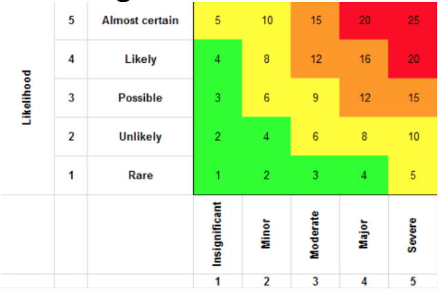

# Not All Tests are the Same
I have worked on projects on multiple occasions where I learned how all automated tests are not the same.

They differ from each other in at least two ways, speed of execution and risk of failure.

While the [test pyramid](https://martinfowler.com/articles/practical-test-pyramid.html) is QA 101, it's also one of the most ignored learning. One project that I worked on depended heavily on Unit testing, while the other relied heavily on Selenium-based UI testing. Both approaches have their shortcomings.

### Test Pyramid
The first approach, which depended solely on unit testing of backend code, had many false positives. In this scenario, the test cases passed all the time. Yet, the software in production did not work. This false assurance could be because of a lack of JavaScript tests or missed 3rd party integration errors because of the unit tests' limited scope.

The second approach had precisely the opposite issue. This approach had lots of false negatives. Here many test cases failed, but things were not broken to the extent indicated. For instance, a single bug could cause 100 broken Selenium test cases, or a few percent of test cases would always break due to timeouts or other issues not related to the code in production.
This discussion brings us back to the Test Pyramid. Any organization or project's testing strategy should include a combination of unit tests, integration tests, Selenium tests, manual tests, etc.

Image credit: https://martinfowler.com/articles/practical-test-pyramid.html

Companies like Google tag the test cases by their sizes S, M, L, and XL, which I believe is the same thing as the test pyramid, wherein as you go towards the tip of the pyramid, your tests get bigger in terms of execution time as well as efforts.

A test strategy that breaks down the test cases by size and/or type can efficiently tell us exactly where the problems are, with minimal effort and time.

### Risk-based testing
Now that we know that not all tests are the same in size and speed, we will explore how they also differ in their impact and risk. It makes sense to run all the tests when a project is small enough, but as it grows, executing all tests may take hours or days. A simple strategy at such times is to distribute your test cases in a quadrant of likelihood of failure and impact of failure. A test case with a higher possibility of failure and a high impact is the kind that should be prioritized.
To use this methodology, we assign two measures to each of the test cases.
Frequency of failure: Using historical data, one can figure out the likelihood of failure. A test that's always known to pass can be given the score of one, and a test that's know to fail a lot can get a score of five.
Impact: A failing test case which does not harm much can be given a score of one. Versus, if there are scenarios that if broken, can do permanent damage to the company's image, then they should be given a score of five.
This scoring finally should be arranged in a matrix like the following image.

The product of these two measures gives you a Risk Score for each of the test cases. For example, you may decide to prioritize every test case that gets a score of 12 and higher. These test cases are the high impact, high likelihood ones that must pass even before the alpha version of a product comes out, giving the alpha version a certain basic stability while ensuring an early rollout.

References:

[Test Pyramid](https://martinfowler.com/articles/practical-test-pyramid.html)

[How Google Tests Software by James Whittaker, Jason Arbon, Jeff Carollo](https://www.amazon.in/Google-Tests-Software-James-Whittaker/dp/0321803027)
